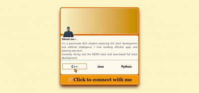

# Personal Card Component with Tailwind CSS

This project showcases a **personal card component** built using **HTML** and **Tailwind CSS**. The card is designed to **adapt seamlessly across screen sizes**, maintaining a clean and aesthetic layout on both **small (mobile)** and **large (desktop)** devices.

## 🔍 Features

- 📱 **Mobile-Friendly Design** – Fully responsive layout.
- 💻 **Desktop-Optimized** – Enhanced spacing and layout for large screens.
- 🎨 **Tailwind CSS** – Styled entirely using Tailwind utility classes.
- ⚡ **Lightweight & Fast** – Simple HTML structure with no external JS.

## 🖼️ Screenshots

### Mobile View


### Desktop View



## 🛠️ Technologies Used

- **HTML5**
- **Tailwind CSS**

## 🚀 How to Run

1. Clone the repository:

```bash
git clone https://github.com/Asad-bot07/personal-card.git
